<p align="center">
  <a href="" rel="noopener">
 </a>
</p>

<h3 align="center">SPACE SHOT</h3>

<div align="center">

[]()
[](https://github.com/kylelobo/The-Documentation-Compendium/issues)
[](https://github.com/kylelobo/The-Documentation-Compendium/pulls)
[](/LICENSE)

</div>

---

<p align="center"> Space Shot is a video game inspired by the horizontal scrolling shoot them up Rtype, developed by Irem and started in 1987 on arcade terminals. Its particularity is the addition of an online and cross-platform multiplayer feature. I hope that as a player or developer, you will have fun playing it.
    <br>

</p>

## 📝 Table of Contents

- [About](#about)
- [Getting Started](#getting_started)
- [App Communication](#comm)
- [Built Using](#built_using)
- [System infos](#system_infos)
- [Contributors](#authors)

## 🧐 About <a name = "about"></a>

In this game you are a warrior enrolled in the Space Guardians unity. As such you have to fight the terrible power of Zobys the worst creatures in the galaxy.<br>
You have to fight using your spaceship. Use the directional touches of the keyboard to navigate through the universe and shot missiles with space bar to blast your enemies. Don't let any of them escape and even more don't ever let them touch you. Why ? Your war ship is an offensive monster but a true larva in defense. He can't endure a chock with those monsters keep it in mind soldier!
You can decide to play in coop mode with your friends through our online server which allow a cooperation of 4 players. So don't hesitate! Bring your friends and have fun destroying your enemies.

## 🏁 Getting Started <a name = "getting_started"></a>

These instructions will get you a copy of the project up and running on your local machine for development and testing purposes. See [deployment](#deployment) for notes on how to deploy the project on a live system.


### . Prerequisites


In order to install this project dependencies you need to install first the package manager conan.
You can use:

```
$ pip install conan

```

When Conan is installed with pip, usually a new directory is created for it. However, the directory is not appended automatically to the PATH and the conan commands do not work. This can usually be solved restarting the session of the terminal or running the following command:

```
$ source ~/.profile

```

On Windows you can use the Windows exe installer to set conan on your setup.
You can check the [conan official page FAQ](https://docs.conan.io/en/1.46/installation.html) for more help


### . Compilation


To compile the program and get the binary or executable file (depending on your operating system)
run the build script

```
./build.sh
```

The build.sh script will create a build directory where it will launch the command:

```
conan install .. --build=missing  -s compiler.libcxx=libstdc++11 -j3
```
Which will install the project dependecies.


### . Launch the program


The compilation step was successful, you now have two binaries/executables:
r-type_client and r-type_server.
If the server is not yet running, run it first and then the client which will open the game window after connecting to the server.

The server will ask you on which port and host it should operate. Host it online or on a local network to play on different machines.


## 🎈 App Communication <a name="comm"></a>


In order to play with many player from different windows each player send his informations to the server who is in charge of share it with all the connected player in the game:


To know more about the encrypting system refer to <a href="https://github.com/EpitechPromo2025/B-CPP-500-COT-5-1-rtype-prunella.dousso/blob/master/R-Type%20Network%20Protocol.txt">R-Type Network Protocol.txt</a>.

## 🚀 System Infos <a name = "system_info"></a>

Refer to the <a href="https://seaborne-compressio.000webhostapp.com/html/annotated.html">Project Doxygen Documentation</a>

## ⛏️ Built Using <a name = "built_using"></a>

- [SFML](https://www.sfml-dev.org/) Client graphical library
- [ENET](http://enet.bespin.org/) UDP Network Communicator

```mermaid
pie
title Contributors Commits
"Florian Mehou" : 45
"Loïc Tossou" : 41
"Prunella DOUSSO" : 8
"Théophile Quenum" : 17
"Spéro" : 5
```

## ✍️ Contributors <a name = "authors"></a>


GET /repos/:elsie200/:repo/commits
- [Florian Mehou](https://github.com/FlorianHNQC)
- [Loïc Tossou](https://github.com/loictossou2004)
- [Prunella Dousso](https://github.com/elsie200)
- [Spéro Tossogbe](https://github.com/spero2003)
- [Théophile Quenum](https://github.com/sergie11)
